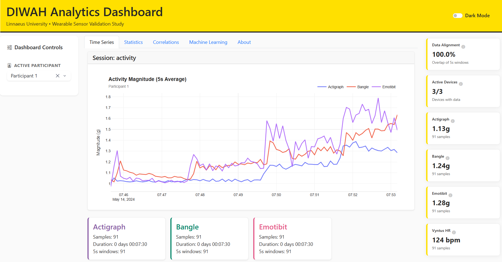
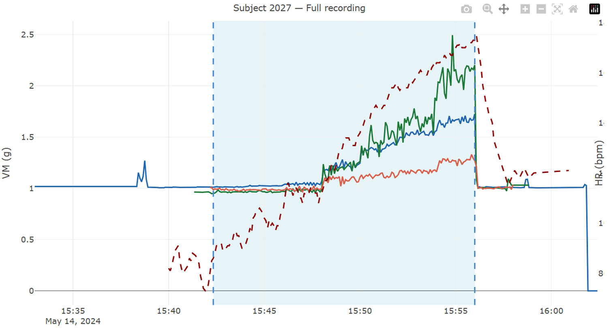
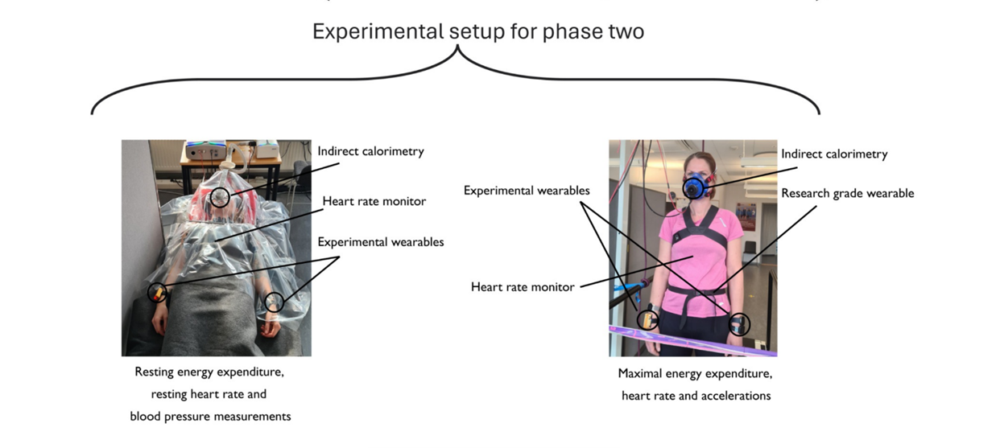

# DIWAH Intelligent Wearable Dashboard
## Predicting Exercise Intensity from Smartwatch Data: Device Capabilities and Limitations

A Bachelor's Thesis Project by **Hanna Szalai** & **Yasmin Akoor**

> **Live Dashboard:** This dashboard is available for Linnaeus University students and staff at **[https://cu3221.camp.lnu.se/](https://cu3221.camp.lnu.se/)**

## About The Project

Wearable sensors and machine learning are increasingly used to predict exercise energy expenditure to promote health, especially in the elderly. However, popular commercial wearables (like Fitbit or Apple Watch) are expensive, "black box" systems that restrict access to raw sensor data. 

This thesis investigates whether significantly **cheaper, open-source consumer wearables** can reliably predict exercise intensity using raw heart rate and accelerometer data. By comparing models trained on open-source devices (**EmotiBit, Bangle.js**) against a research-grade clinical baseline (**ActiGraph**), we evaluate their predictive accuracy against a medical-grade **Vyntus calorimetry systems** (a breathing mask that tracks exact oxygen consumption).

This work determines if accessible, open-source hardware is computationally viable for accurate health tracking and remote physiotherapy applications.

### In Collaboration With
**[The DIWAH Project (Design of an Intelligent Wearable for Activity and Health)](https://lnu.se/en/research/research-groups/linnaeus-university-centre-for-data-intensive-sciences-and-applications/seed-projects/seed-project-development-of-an-intelligent-wearable-the-diwah-study/)** at Linnaeus University, led by Patrick Bergman. We utilize the anonymized, multi-sensor dataset collected specifically for this study.

---

## Research Questions & Knowledge Gap

There is a distinct lack of empirical Computer Science research evaluating the full predictive pipeline of fully open-source wearables. This project aims to bridge that gap through two distinct research phases:

1. **RQ1 (Design Science):** How can heterogeneous data streams from three different wearable devices with varying sampling rates, missing data, and clock drift be reliably synchronized and mathematically aligned for comparative analysis?
2. **RQ2 (Controlled Experiment):** Given properly synchronized heart rate and accelerometer data across heterogeneous wearables, is it feasible to predict exercise intensity (METs), and how does prediction performance vary by device architecture?

---

## Methodology

Our pipeline consists of solving two data engineering challenges before any Machine Learning is performed: **Timestamp Synchronization** and **Feature Extraction**.

We used a tool called **Shiny App** to manually cut, align, and synchronize the raw data. The synchronized epochs created from this tool form the core dataset we ingest.

*Figure: The Shiny App visual application being used to cut and synchronize a subject's timeline.*

*Figure: All the wearables and clinical devices worn by a subject during data collection.*

---

## Steps, Milestones, and Actions

- **Data Integration Tools:** Develop parsing and mathematical alignment tools to synchronize the raw, un-synced data from the ActiGraph, EmotiBit, and Bangle.js.
- **Database Setup:** Deploy an InfluxDB architecture specifically optimized for high-frequency time-series sensor storage.
- **Dashboard Development:** Build a visual dashboard to manually validate the data alignment and inspect the heart rate and movement data prior to machine learning.
- **Feature Extraction:** Use the open-source FLIRT Python package to extract standardized physiological features from 5-second data epochs.
- **Model Training & Evaluation:** Train simple regression and basic ML models (e.g., Random Forest) on the extracted features, and compare their predicted MET values against the Vyntus golden standard.

---

### Prerequisites
- **Python 3.9+**
- **Docker & Docker Compose** (for InfluxDB)

---

### Participant Information
[Click here to view Participant Information Document](docs/participants.md)